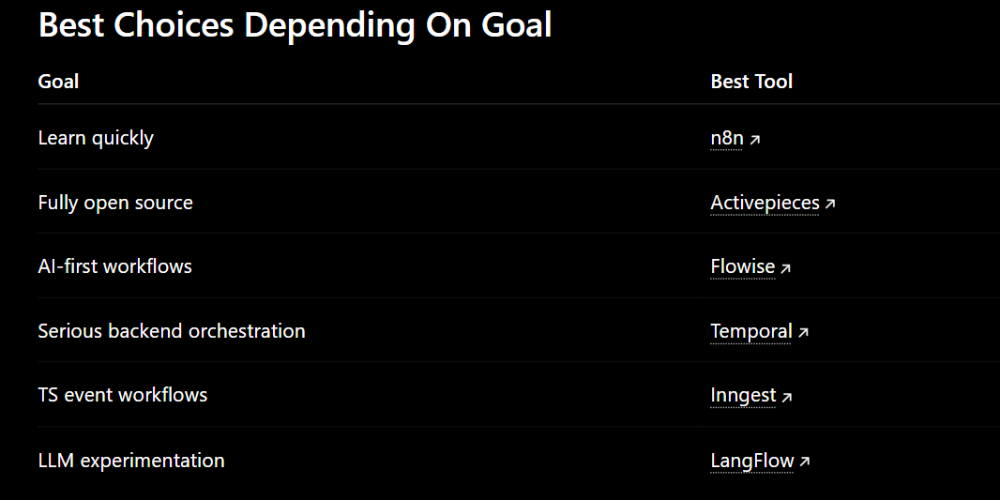

you can use open-source orchestration / AI workflow tools that provide for different purposes:

- workflow management
- retries
- visual flows
- tool chaining
- queues
- state
- observability
- AI integrations

while still allowing TypeScript customization.

---
Open source tools for AI workflow orchestration:- 

